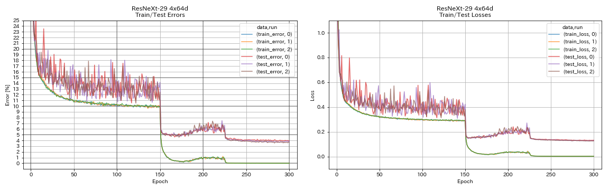
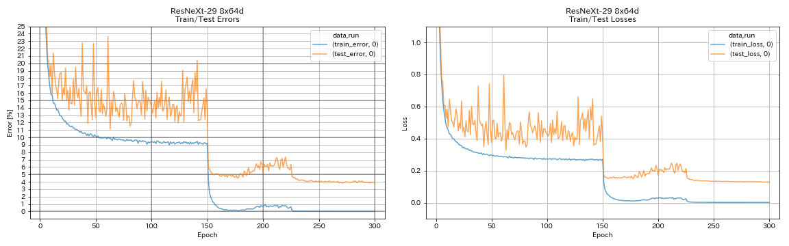

# PyTorch Implementation of ResNeXt

## Usage

```
$ python main.py --depth 29 --cardinality 4 --base_channels 64 --outdir results
```

## Results on CIFAR-10

| Model             | Test Error (median of 3 runs) | Test Error (in paper)     | Training Time |
|:------------------|:-----------------------------:|:-------------------------:|--------------:|
| ResNeXt-29 4x64d  | 3.89                          | ~3.75 (from Figure 7)     |  31h17m       |
| ResNeXt-29 8x64d  | 3.97 (1 run)                  | 3.65 (average of 10 runs) |  42h50m*      |
| ResNeXt-29 16x64d |                               | 3.58 (average of 10 runs) |               |




**NOTE** Both models were trained with single GPU. ResNeXt-29 4x64d was trained with batch size 32 and initial learning rate 0.025. ResNeXt-29 8x64d was trained with batch size 64 and initial learning rate 0.05. In the paper, they use 8 GPUs, batch size 128 and initial learning rate 0.1.

## References

* Xie, Saining, et al. "Aggregated residual transformations for deep neural networks." The IEEE Conference on Computer Vision and Pattern Recognition (CVPR), 2017, pp. 1492-1500. [arXiv:1611.05431]( https://arxiv.org/abs/1611.05431 ), [Torch implementation]( https://github.com/facebookresearch/ResNeXt )


